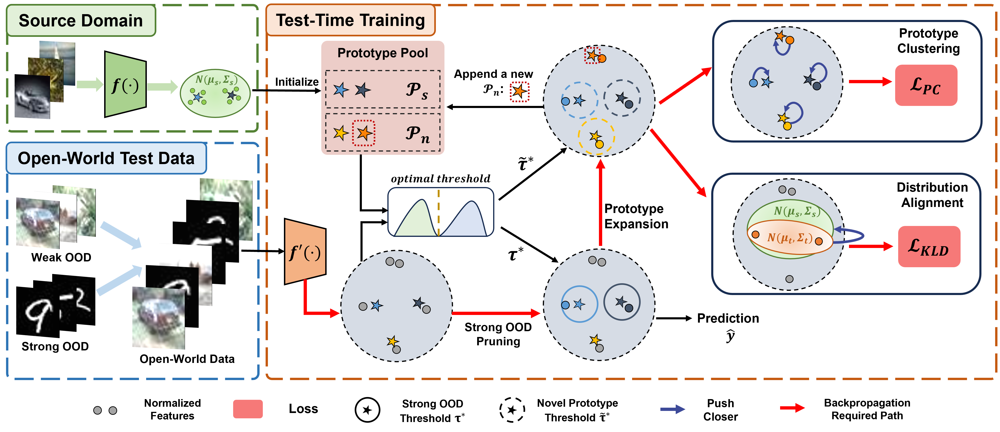

# OWTTT

This repository is an official implementation for our [ICCV 2023 Oral] paper.

## On the Robustness of Open-World Test-Time Training: Self-Training with Dynamic Prototype Expansion

**[Yushu Li](https://yushu-li.github.io/)<sup>1</sup>** &nbsp; **[Xun Xu](https://alex-xun-xu.github.io/)<sup>2</sup>** &nbsp; **[Yongyi Su](https://yysu.site/)<sup>1</sup>** &nbsp;  **[Kui Jia](http://kuijia.site/)<sup>1</sup>**
<br>
<sup>1</sup>South China University of Technology &nbsp; 
<br><sup>2</sup>Institute for Infocomm Research (I2R), Agency for Science, Technology and Research (A*STAR)
<br>

[](https://arxiv.org/abs/2308.09942)
[](https://yushu-li.github.io/owttt-site/)


### Overview




### CIFAR10-C/CIFAR100-C

The code is released in the [cifar](cifar) folder.

### ImageNet-C/ImageNet-R

The code is released in the [imagenet](imagenet) folder.

### Citation

If you find our work useful in your research, please consider citing:

```bibtex
@inproceedings{
  li2023robustness,
  title={On the Robustness of Open-World Test-Time Training: Self-Training with Dynamic Prototype Expansion},
  author={Li, Yushu and Xu, Xun and Su, Yongyi and Jia, Kui},
  booktitle={Proceedings of the IEEE/CVF International Conference on Computer Vision (ICCV)},
  month={October},
  year={2023}
}
```